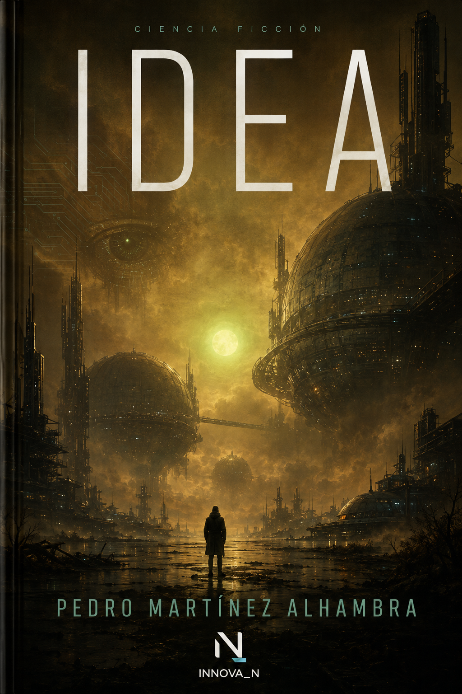

# IDEA

  

## Pedro Martínez Alhambra

**Novela de ciencia ficción / Science-fiction novel**  
**Escrita entre 1997 y 2002 / Written between 1997 and 2002**  
**Presentada al Premio UPC de Ciencia Ficción en 2002 / Submitted to the UPC Science Fiction Award in 2002**  
**Primera edición pública en 2026 / First public edition in 2026**

> «Las ideas más simples pueden contener universos.»  
> “The simplest ideas may contain universes.”

---

## ES · La obra

**IDEA** fue escrita por Pedro Martínez Alhambra entre 1997 y 2002. En 2002 fue presentada, con leves cambios, al Premio UPC de Ciencia Ficción.

La primera edición pública apareció en 2026 mediante una **restauración conservadora**. Se corrigieron erratas, ortografía, puntuación, caracteres heredados de antiguas conversiones e incoherencias materiales de edición sin reescribir la obra desde la perspectiva actual del autor.

IDEA pertenece al joven que la escribió antes de que existieran la Neodialéctica™, Innova_N, NEOCore™, NAVE™, Síntesis Abierta™ o el vocabulario posterior del marco.

En sus páginas ya aparecen preguntas sobre:

* inteligencia artificial;
* control;
* emoción;
* identidad;
* memoria;
* percepción;
* ecología;
* simbiosis;
* realidad;
* conciencia;
* poder;
* soledad;
* y autoselección.

No se presenta como profecía ni como una obra creada originalmente dentro de Innova_N.

Se publica como **documento de origen**, obra previa del fundador y nodo literario enlazado actualmente desde la capa cultural, la capa personal y autoral y **WEB4™ · Capa pública SistemaTrazable™**.

Actualmente funciona como puerta de entrada narrativa a la Neodialéctica, sin alterar su cronología ni convertir retrospectivamente la obra en producto del marco posterior.

### Starkdr, Gritax y la guerra-motor

La historia de las especies Starkdr y Gritax contiene una de las arquitecturas centrales de *IDEA*: conflicto, inteligencia artificial, control, simbiosis, autoselección y el descubrimiento de que incluso quien cree dirigir un sistema puede estar siendo dirigido por él.

* [Historia de las especies · Starkdr, Gritax y guerra-motor](./STARKDR_GRITAX_HISTORIA_DE_LAS_ESPECIES_ES_EN.md)
* [Leer IDEA · edición en castellano](https://www.amazon.es/dp/B0HBRQGNQL)

La guía se limita al contenido publicado de la novela 1997–2002 y a la lectura pública autorizada, sin anticipar obras posteriores.

---

## Posición pública y fuente canónica

* **Nodo documental canónico:** este archivo `obras/idea/README.md`, versionado mediante commits en el repositorio principal.
* **Página Wiki:** guía de orientación y acceso; no sustituye los datos, estados ni documentos canónicos del repositorio.
* **WEB4™ · Capa pública SistemaTrazable™:** obra literaria integrada en el ecosistema creativo y cultural.
* **Capa personal y autoral:** obra de Pedro Martínez Alhambra dentro de sus creaciones originales.
* **Amazon:** distribución comercial de las ediciones publicadas.

La incorporación de IDEA al ecosistema actual no modifica su fecha, su contexto de creación ni su genealogía.

---

## Doce idiomas actuales

IDEA está disponible actualmente en doce idiomas, con ediciones digitales e impresas según disponibilidad.

| Idioma                        | ASIN o enlace de referencia | Amazon                                               |
| ----------------------------- | --------------------------: | ---------------------------------------------------- |
| Castellano · Español          |              `B0HBRQGNQL` | [Abrir edición](https://www.amazon.es/dp/B0HBRQGNQL) |
| Francés · Français            |              `B0HBRNFMN7` | [Abrir edición](https://www.amazon.es/dp/B0HBRNFMN7) |
| Alemán · Deutsch              |              `B0H4HYBTGL` | [Abrir edición](https://www.amazon.es/dp/B0H4HYBTGL) |
| Portugués · Português         |              `B0HBXD3P1D` | [Abrir edición](https://www.amazon.es/dp/B0HBXD3P1D) |
| Inglés · English              |              `B0HBXLKC9W` | [Abrir edición](https://www.amazon.es/dp/B0HBXLKC9W) |
| Italiano · Italiano           |              `B0HBZ1VCXP` | [Abrir edición](https://www.amazon.es/dp/B0HBZ1VCXP) |
| Neerlandés · Nederlands       |              `B0HBZHLHJJ` | [Abrir edición](https://www.amazon.es/dp/B0HBZHLHJJ) |
| Sueco · Svenska               |              `B0HC8N69BT` | [Abrir edición](https://www.amazon.es/dp/B0HC8N69BT) |
| Danés · Dansk                 |              `B0HCC74TPK` | [Abrir edición](https://www.amazon.es/dp/B0HCC74TPK) |
| Noruego bokmål · Norsk bokmål |              `B0HCCL44TZ` | [Abrir edición](https://www.amazon.es/dp/B0HCCL44TZ) |
| Finlandés · Suomi             |              `B0HCRHFMRG` | [Abrir edición](https://www.amazon.es/dp/B0HCRHFMRG) |
| Polaco · Polski               | Enlace confirmado | [Abrir edición](https://amzn.eu/d/0a10Qv5a) |

### Formatos físicos y digitales confirmados

* [Castellano · tapa blanda · `B0HBP261YZ`](https://www.amazon.es/dp/B0HBP261YZ)
* **Noruego bokmål:** Kindle, tapa blanda y tapa dura publicados. El ASIN específico de tapa blanda queda pendiente de verificación.
* [Finlandés · eBook · `B0HCRHFMRG`](https://www.amazon.es/dp/B0HCRHFMRG)
* [Finlandés · tapa blanda · `B0HCVSX23V`](https://www.amazon.es/dp/B0HCVSX23V)
* [Finlandés · tapa dura · `B0HCRMCRPT`](https://www.amazon.es/dp/B0HCRMCRPT)

### Estado actualizado · 6 de agosto de 2026

* KDP y Author Central confirmaron por escrito la asociación correcta con la Página de Autor de los formatos publicados de IDEA en doce idiomas.
* El autor verificó la corrección de las asociaciones e idiomas mostrados. La incidencia de idioma y asociación de la edición finlandesa se considera **operativamente resuelta**.
* La disponibilidad de una edición concreta puede variar por formato y marketplace; los enlaces comerciales deben comprobarse en Amazon en el momento de la consulta.
* **Noruego no bokmål:** todavía no publicado y no incluido en la cifra actual.
* **Japonés:** edición en preparación; no se considera una incidencia de asociación.

### Auditoría y aprendizaje derivados

* [Caso de éxito · auditoría gratuita a Amazon KDP y Author Central](../../auditorias/publicas/2026-08-06_caso_exito_auditoria_gratuita_amazon_kdp_author_central_ES_EN.md)
* [Auditoría indirecta pública de origen](../../analisis/publicos/2026-08-06_auditoria-indirecta-kdp-author-central-idea_ES_EN.md)

La publicación internacional de IDEA permitió detectar incoherencias, obtener una corrección verificable y trasladar propuestas de mejora recibidas positivamente por KDP.

---

## Prensa y reseñas

* Se aceptan reseñas independientes y no se solicita una valoración favorable.
* La portada puede reproducirse con atribución para información, reseña o entrevista.
* No se distribuyen automáticamente PDF de imprenta, EPUB, DOCX maestros ni interiores completos.
* Las copias de prensa requieren autorización individual.

---

## Enlaces públicos

### Fuentes canónicas del repositorio

* [Este nodo documental de IDEA](./README.md)
* [Ediciones internacionales](./EDICIONES.md)
* [Metadatos públicos](./METADATA.json)
* [Registro de enlaces](./LINKS.json)
* [Kit público ES/EN](./PRESS_KIT_ES_EN.md)
* [Historia de las especies Starkdr–Gritax](./STARKDR_GRITAX_HISTORIA_DE_LAS_ESPECIES_ES_EN.md)

### Orientación y relaciones dentro del ecosistema

* [Página de orientación de IDEA en la Wiki](https://github.com/PedroAlhambra/Innova-n.org-NEOCORE-NEODIALECTICA-NEODIALECTIC/wiki/IDEA_1997_2002_Edicion_Internacional_2026)
* [WEB4™ · Capa pública SistemaTrazable™](https://github.com/PedroAlhambra/Innova-n.org-NEOCORE-NEODIALECTICA-NEODIALECTIC/wiki/Web4_Public_Layer)
* [Ecosistema creativo y cultural](https://github.com/PedroAlhambra/Innova-n.org-NEOCORE-NEODIALECTICA-NEODIALECTIC/wiki/Ecosistema_Creativo_y_Cultural)
* [Creaciones originales del autor](https://github.com/PedroAlhambra/Innova-n.org-NEOCORE-NEODIALECTICA-NEODIALECTIC/wiki/Creaciones_Originales_del_Autor)
* [Perfil de Pedro Martínez Alhambra en Amazon](https://www.amazon.es/stores/Pedro-Mart%C3%ADnez-Alhambra/author/B0HC3TWRZ7)

---

## Relación histórica

IDEA antecede a:

* la Filosofía Arquetípica Neodialéctica™;
* Innova_N;
* NEOCore™;
* NAVE™;
* SAN™;
* WEB4™;
* y el vocabulario posterior del marco.

Su integración actual no pretende reescribir retrospectivamente la obra.

Se incorpora como:

* creación literaria previa del fundador;
* documento de trayectoria;
* antecedente creativo;
* nodo cultural;
* puerta de entrada narrativa actual a la Neodialéctica;
* y obra pública conectada con el ecosistema actual.

---

## EN · The work

**IDEA** was written by Pedro Martínez Alhambra between 1997 and 2002. In 2002, a slightly revised version was submitted to the UPC Science Fiction Award.

Its first public edition appeared in 2026 through a **conservative restoration**. Typographical errors, spelling, punctuation, legacy conversion characters and material editorial inconsistencies were corrected without rewriting the work from the author’s present-day perspective.

IDEA belongs to the young writer who created it before Neodialectics™, Innova_N, NEOCore™, NAVE™, Open Synthesis™ or the later vocabulary of the framework existed.

Its pages already raise questions about:

* artificial intelligence;
* control;
* emotion;
* identity;
* memory;
* perception;
* ecology;
* symbiosis;
* reality;
* consciousness;
* power;
* solitude;
* and self-selection.

It is not presented as a prophecy or as a work originally created within Innova_N.

It is published as an **origin document**, an earlier work by the Founder and a literary node currently linked from the cultural layer, the personal and authorial layer and **WEB4™ · SistemaTrazable™ Public Layer**.

It now functions as a narrative gateway into Neodialectics without altering its chronology or retrospectively turning the work into a product of the later framework.

### Starkdr, Gritax and the motor-war

The history of the Starkdr and Gritax species contains one of *IDEA*'s central architectures: conflict, artificial intelligence, control, symbiosis, self-selection and the discovery that even those who believe they direct a system may themselves be directed by it.

* [History of the species · Starkdr, Gritax and motor-war](./STARKDR_GRITAX_HISTORIA_DE_LAS_ESPECIES_ES_EN.md)
* [Read IDEA · Spanish edition](https://www.amazon.es/dp/B0HBRQGNQL)

The guide is limited to the published 1997–2002 novel and the authorised public reading, without anticipating later works.

---

## Public position and canonical source

* **Canonical documentary node:** this `obras/idea/README.md` file, versioned through commits in the main repository.
* **Wiki page:** an orientation and access guide; it does not replace canonical repository data, states or documents.
* **WEB4™ · SistemaTrazable™ Public Layer:** literary work within the creative and cultural ecosystem.
* **Personal and authorial layer:** a work by Pedro Martínez Alhambra within his original creations.
* **Amazon:** commercial distribution of the published editions.

The integration of IDEA into the current ecosystem does not alter its date, original context or genealogy.

---

## Twelve current editions

IDEA is currently available in twelve languages, in digital and print editions depending on availability.

| Language                        | Reference ASIN or link | Amazon                                              |
| ------------------------------- | ---------------------: | --------------------------------------------------- |
| Spanish · Español               |          `B0HBRQGNQL` | [Open edition](https://www.amazon.es/dp/B0HBRQGNQL) |
| French · Français               |          `B0HBRNFMN7` | [Open edition](https://www.amazon.es/dp/B0HBRNFMN7) |
| German · Deutsch                |          `B0H4HYBTGL` | [Open edition](https://www.amazon.es/dp/B0H4HYBTGL) |
| Portuguese · Português          |          `B0HBXD3P1D` | [Open edition](https://www.amazon.es/dp/B0HBXD3P1D) |
| English · English               |          `B0HBXLKC9W` | [Open edition](https://www.amazon.es/dp/B0HBXLKC9W) |
| Italian · Italiano              |          `B0HBZ1VCXP` | [Open edition](https://www.amazon.es/dp/B0HBZ1VCXP) |
| Dutch · Nederlands              |          `B0HBZHLHJJ` | [Open edition](https://www.amazon.es/dp/B0HBZHLHJJ) |
| Swedish · Svenska               |          `B0HC8N69BT` | [Open edition](https://www.amazon.es/dp/B0HC8N69BT) |
| Danish · Dansk                  |          `B0HCC74TPK` | [Open edition](https://www.amazon.es/dp/B0HCC74TPK) |
| Norwegian Bokmål · Norsk bokmål |          `B0HCCL44TZ` | [Open edition](https://www.amazon.es/dp/B0HCCL44TZ) |
| Finnish · Suomi                 |          `B0HCRHFMRG` | [Open edition](https://www.amazon.es/dp/B0HCRHFMRG) |
| Polish · Polski                 | Confirmed link | [Open edition](https://amzn.eu/d/0a10Qv5a) |

### Confirmed digital and print formats

* [Spanish · paperback · `B0HBP261YZ`](https://www.amazon.es/dp/B0HBP261YZ)
* **Norwegian Bokmål:** Kindle, paperback and hardcover published. The paperback-specific ASIN remains pending verification.
* [Finnish · eBook · `B0HCRHFMRG`](https://www.amazon.es/dp/B0HCRHFMRG)
* [Finnish · paperback · `B0HCVSX23V`](https://www.amazon.es/dp/B0HCVSX23V)
* [Finnish · hardcover · `B0HCRMCRPT`](https://www.amazon.es/dp/B0HCRMCRPT)

### Updated status · 6 August 2026

* KDP and Author Central confirmed in writing the correct association with the Author Page of published IDEA formats in twelve languages.
* The author verified the corrected associations and displayed languages. The Finnish language and association incident is considered **operationally resolved**.
* Availability of a specific edition may vary by format and marketplace; commercial links should be checked on Amazon at the time of consultation.
* **Non-Bokmål Norwegian:** not yet published and not included in the current total.
* **Japanese:** edition in preparation; this is not treated as an association incident.

### Derived audit and learning

* [Success case · free audit for Amazon KDP and Author Central](../../auditorias/publicas/2026-08-06_caso_exito_auditoria_gratuita_amazon_kdp_author_central_ES_EN.md)
* [Originating public indirect audit](../../analisis/publicos/2026-08-06_auditoria-indirecta-kdp-author-central-idea_ES_EN.md)

The international publication of IDEA made it possible to detect inconsistencies, achieve a verifiable correction and submit improvement proposals positively received by KDP.

---

## Press and reviews

* Independent reviews are welcome; no favourable assessment is requested.
* The cover may be reproduced with attribution for reporting, review or interview purposes.
* Print-ready PDFs, EPUB files, master DOCX files and complete interiors are not distributed automatically.
* Press copies require individual authorisation.

---

## Public links

### Canonical repository sources

* [This IDEA documentary node](./README.md)
* [International editions](./EDICIONES.md)
* [Public metadata](./METADATA.json)
* [Link register](./LINKS.json)
* [Public ES/EN kit](./PRESS_KIT_ES_EN.md)
* [History of the Starkdr–Gritax species](./STARKDR_GRITAX_HISTORIA_DE_LAS_ESPECIES_ES_EN.md)

### Orientation and ecosystem relations

* [IDEA orientation page in the Wiki](https://github.com/PedroAlhambra/Innova-n.org-NEOCORE-NEODIALECTICA-NEODIALECTIC/wiki/IDEA_1997_2002_Edicion_Internacional_2026)
* [WEB4™ · SistemaTrazable™ Public Layer](https://github.com/PedroAlhambra/Innova-n.org-NEOCORE-NEODIALECTICA-NEODIALECTIC/wiki/Web4_Public_Layer)
* [Creative and cultural ecosystem](https://github.com/PedroAlhambra/Innova-n.org-NEOCORE-NEODIALECTICA-NEODIALECTIC/wiki/Ecosistema_Creativo_y_Cultural)
* [Original creations of the author](https://github.com/PedroAlhambra/Innova-n.org-NEOCORE-NEODIALECTICA-NEODIALECTIC/wiki/Creaciones_Originales_del_Autor)
* [Pedro Martínez Alhambra on Amazon](https://www.amazon.es/stores/Pedro-Mart%C3%ADnez-Alhambra/author/B0HC3TWRZ7)

---

## Historical relationship

IDEA predates:

* the Archetypal Neodialectical Philosophy™;
* Innova_N;
* NEOCore™;
* NAVE™;
* SAN™;
* WEB4™;
* and the later vocabulary of the framework.

Its present integration does not attempt to rewrite the work retrospectively.

It is incorporated as:

* an earlier literary creation by the Founder;
* a document of trajectory;
* a creative antecedent;
* a cultural node;
* a present narrative gateway into Neodialectics;
* and a public work connected to the current ecosystem.

---

## Derechos / Rights

**© 2026 Pedro Martínez Alhambra. Todos los derechos reservados / All rights reserved.**

Este nodo no distribuye:

* el interior completo de la obra;
* archivos EPUB;
* PDF de imprenta;
* DOCX maestros;
* portadas de producción;
* ni otros recursos restringidos.

This node does not distribute:

* the complete interior of the work;
* EPUB files;
* print-ready PDFs;
* master DOCX files;
* production covers;
* or other restricted resources.